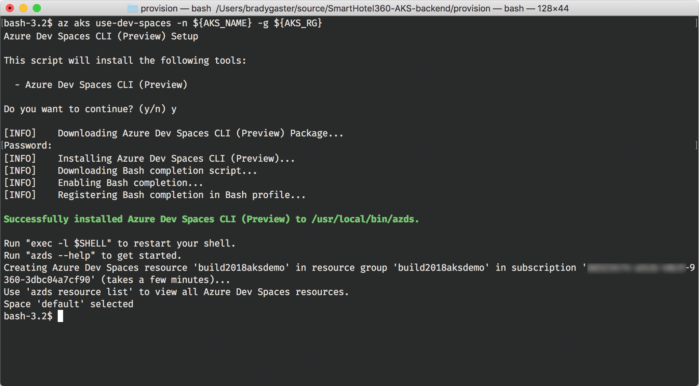

# SmartHotel360 AKS Demo Setup

All of the back-end systems run inside of Docker containers. During the installation phase you will notice errors if you haven't set your Docker configuration to use 4 GB of memory. Changing this is simple within the Docker configuration dialog. Just set the memory higher and restart Docker.

> Note: The code and deployment process are being updated to use Helm and more Kubernetes-conventional tactics, and minor changes may occur prior to the general availability of Azure Dev Spaces. Watch this repository for updates, as they'll be coming by Summer 2018. 

## Prerequisites 

* Bash command line, which can be accomplished natively on Mac or Linux or using [Windows Subsystem for Linux](https://docs.microsoft.com/en-us/windows/wsl/install-win10) on Windows.
* [Docker](http://www.docker.com) to build the containers. 
* [Visual Studio 2017 Preview](https://www.visualstudio.com/vs/preview/) with the ASP.NET Web workload installed. 
* [Azure Dev Spaces Extension for Visual Studio](https://docs.microsoft.com/en-us/azure/dev-spaces/get-started-netcore-visualstudio#get-the-visual-studio-tools). 
* [Azure CLI](https://docs.microsoft.com/en-us/cli/azure/install-azure-cli?view=azure-cli-latest)
* [Kubernetes CLI](https://kubernetes.io/docs/tasks/tools/install-kubectl/)

## Set up a Service Principal 

[Create a service principal](https://docs.microsoft.com/en-us/azure/azure-resource-manager/resource-group-create-service-principal-portal?view=azure-cli-latest) and take note of the Application ID and key. The service principal will need to be added to the **Contributor** for the subscription.

## Provision the Azure Resources

In this step you'll create all of the Azure resources required by the demo. This consists of an AKS Cluster and an Azure Container Registry (ACR) instance. The AKS Cluster is pre-configured to use Microsoft Operations Management Suite (OMS) and Log Analytics to enable the rich Container Health Dashboard capabilities. 

1. Open a bash terminal. CD into the `provision` folder of this repository. The `01-aks-create.sh` script contains a few parameters that are explained below, as each step of the script. Read below, and then edit the script per your own subscription & cluster names, and then run:

    ```bash
    bash 02-aks-create.sh
    ```

1. Set the variables in the script below (the `exports`) and 
run it in the terminal. 

    **Important Note:** The only regions in which AKS and Azure Dev Spaces are currently supported are Canada East and Eaat US. So when creating a new AKS cluster for this scenario use either **canadaeast** or **eastus** for the **AKS_REGION** variable.

    ```bash
    export SPN_PW=<service principal password> \ 
    export SPN_CLIENT_ID=<service principal app id> \ 
    export AKS_SUB=<azure subscription id> \ 
    export AKS_RG=<resource group name> \ 
    export AKS_NAME=<AKS cluster name> \ 
    export ACR_NAME=<Azure Container Registry name> \ 
    export AKS_REGION=eastus
    ```

1. Run the `az` CLI command below to create a new resource group. 

    ```bash
    az group create -n ${AKS_NAME} -l ${AKS_REGION}
    ```

1. Copy the script below and run it in a bash terminal to execute the Azure Resource Manager template using the `az` CLI. 

    ```bash
    az group deployment create -n ${AKS_NAME}create -g ${AKS_RG} --template-file 01-aks-create.json \
        --parameters \
        resourceName=${AKS_NAME} \
        dnsPrefix=${AKS_NAME} \
        servicePrincipalClientId=${SPN_CLIENT_ID} \
        servicePrincipalClientSecret=${SPN_PW} \
        workspaceRegion="Canada Central" \
        enableHttpApplicationRouting=true \
        enableOmsAgent=true \
        containerRegistryName=${ACR_NAME}
    ```

    > This command may take a few minutes to complete. 

1. Once the cluster is created, take note of the URL value for the `HTTPApplicationRoutingZoneName` property in the response JSON payload. Copy this URL, as it will be used later when deploying the microservices. 

    ```json
    "outputs": {
      "aks": {
        "type": "Object",
        "value": {
          "addonProfiles": {
            "httpApplicationRouting": {
              "config": {
                "HTTPApplicationRoutingZoneName": "<guid>.eastus.aksapp.io"
              },

    ```

1. Install the Azure Dev Spaces extension for the `az` CLI. 

    ```bash
    az extension add --name dev-spaces-preview
    ```

1. Enable Azure Dev Spaces for your AKS cluster. 

    ```bash
    az aks use-dev-spaces -n ${AKS_NAME} -g ${AKS_RG}
    ```

    > This command may take a few minutes to complete. 

    As Azure Dev Spaces is enabled in your cluster you'll see updates on-screen, and eventually be presented with a confirmation message. 

    

## Setup the SmartHotel360 Backend APIs